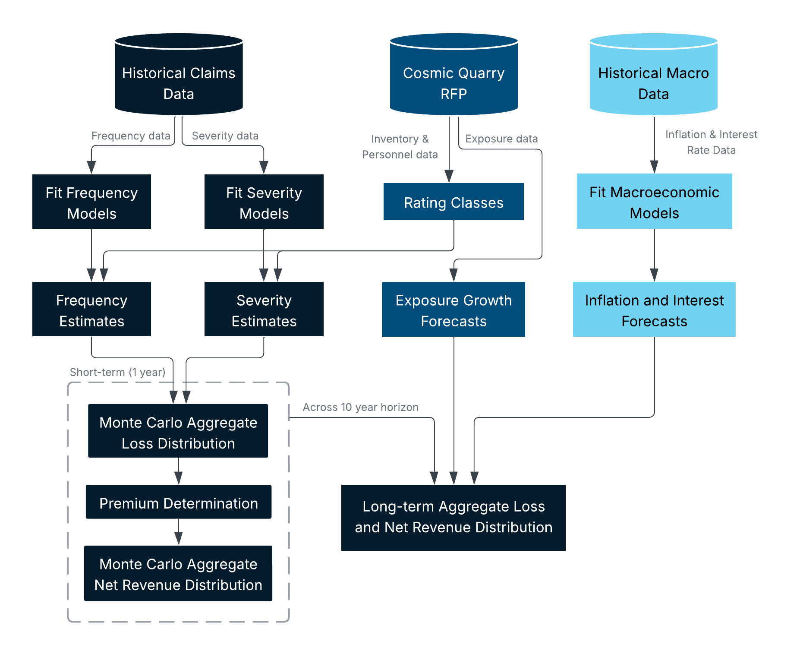
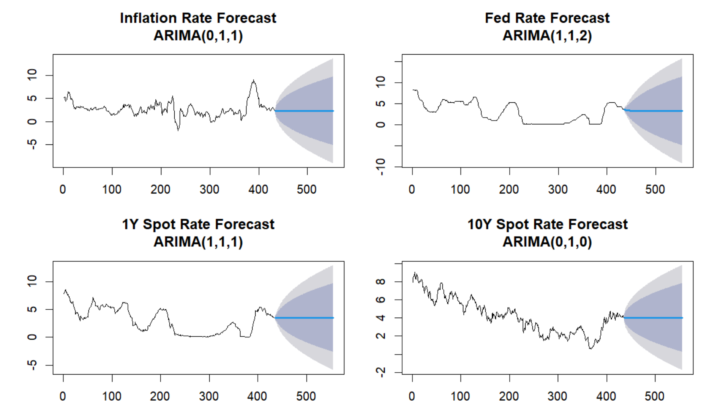
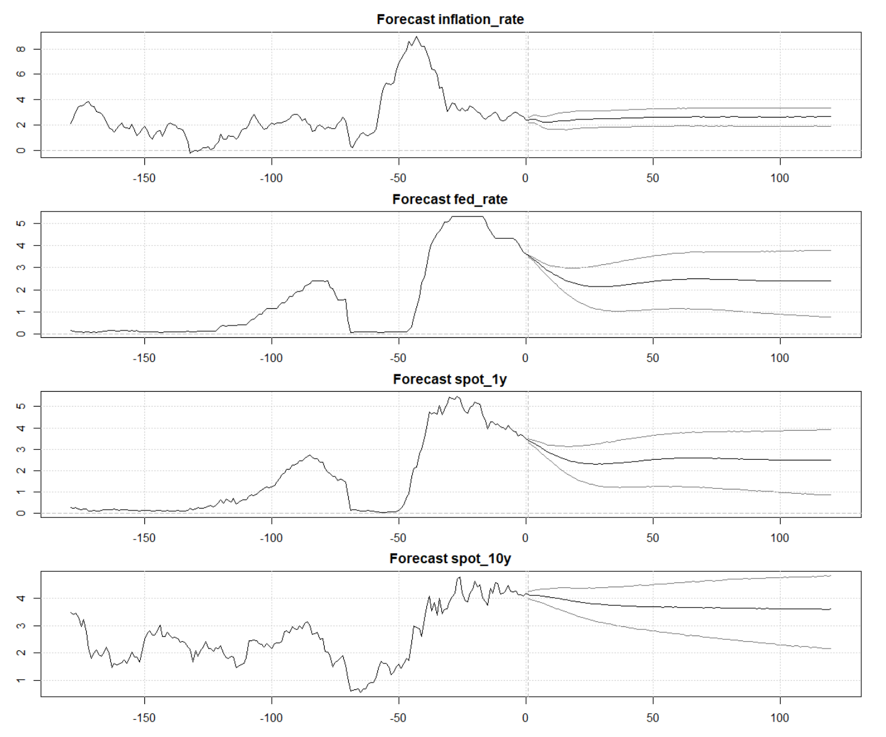
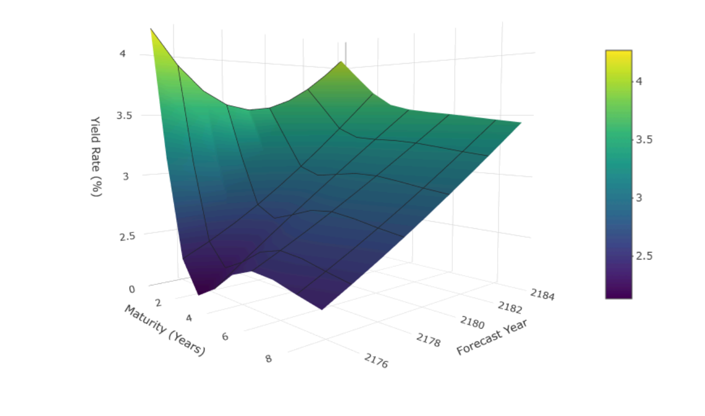

# 2026 SOA Case Study: Supernova Solutions

Team members: Kaleb Vegvari, Samuel Johnston, Oliver Zhou, Seonwoo Baek, Sebastien Nakhoul.

## Table of Contents
- [Project Overview](#project-overview)
- [Business Interruption Coverage](#business-interruption-coverage)
- [Cargo Loss Coverage](#cargo-loss-coverage)
- [Equipment Failure Coverage](#equipment-failure-coverage)
- [Workers Compensation Coverage](#workers-compensation-coverage)
- [Pricing & Capital Modelling](#pricing--capital-modelling)
  - [Modelling Procedure](#modelling-procedure)
  - [Frequency and Severity Models](#frequency-and-severity-models)
  - [Pricing Results](#pricing-results)
  - [Stress Testing](#stress-testing)
  - [Inflation and Interest Modelling](#interest-and-inflation-modelling)
- [Risk Assessment](#risk-assessment)
- [Key Assumptions](#key-assumptions)
- [Data Limitations](#data-limitations)
- [Full Report](#full-report)

## Project Overview

Our team was tasked with developing an insurance pricing strategy for Galaxy General Insurance Company in response to a request for proposals from Cosmic Quarry Mining Corporation. The objective was to design and price coverage across four key hazard areas: Equipment Failure, Cargo Loss, Workers' Compensation, and Business Interruption, for mining operations spanning three solar systems: Helionis Cluster, Bayesia System, and Oryn Delta. Our approach combined actuarial modelling and statistical estimation to produce short and long term projections of aggregate costs, returns, and net revenue, including expected values, variance estimates, and tail risk analysis. 

## Business Interruption Coverage

Galaxy General's Business Interruption coverage for Cosmic Quarry employs a risk transfer structure designed to protect both the insured and insurer from catastrophic tail risks while incentivising strong operational safety practices.

### Design Overview

- Coverage for financial losses incurred from suspended operations due to covered operational and environmental hazards
- Đ30,000 per-occurrence deductible to discourage nuisance claims, with a maximum of 4 claims per policy year
- Risk-adjusted coverage limits allocated by solar system based on production exposure and environmental risk profile
- Excess-of-loss reinsurance protecting against catastrophic losses beyond the primary coverage layer
- Safety-based premium discount program rewarding proactive inspection and operational governance
- Exclusions for non-operational risks (e.g. planned maintenance, market fluctuations, unauthorised hazard zone entry)

### Coverage Structure

| Layer | Limit | Notes |
|---|---|---|
| Primary (Galaxy General) | Up to Đ110M | Allocated across solar systems by risk |
| Reinsurance (XL) | Đ60M xs Đ110M | Covers catastrophic losses up to Đ170M |
| Insured retention | Above Đ170M | Tail risk retained by Cosmic Quarry |

Coverage limits by solar system reflect their distinct risk profiles:

- **Helionis Cluster**: Đ60M limit. High risk: frequent micro-collisions, communication disruptions, and asteroid cluster events (54.5% of production volume)
- **Bayesia System**: Đ25M limit. Lower risk: predictable radiation spike patterns (27.3% of production volume)
- **Oryn Delta**: Đ25M limit. High risk: rapid orbital shear, fluctuating gravitational gradients, low-visibility environment (18.2% of production volume)

### Key Insight

The product balances risk transfer with behavioural incentives. By combining deductibles, claim frequency limits, and a safety discount program, it ensures that:

- Minor, preventable disruptions remain with the insured
- Catastrophic operational losses are effectively transferred through layered coverage
- Strong safety practices are financially rewarded, aligning insurer and insured interests

### Safety-Based Discount Program

Premiums are reduced by **1.5% for each safety inspection above 3 per year**, capped at a **4.5% maximum discount**. This incentivises operational excellence and proactive maintenance, which is particularly valuable given Cosmic Quarry's history of environmental disputes and regulatory scrutiny.

### Scalability

An exposure-based pricing structure allows the product to scale alongside Cosmic Quarry's planned 15–25% operational expansion:

- Coverage limits can be adjusted annually to reflect new production volumes
- System-level allocations remain aligned with underlying exposure as operations grow
- Annual repricing accommodates inflation, environmental condition changes, and evolving risk profiles

## Cargo Loss Coverage

Galaxy General proposes a pooled cargo transport insurance product designed to protect Cosmic Quarry against physical loss or damage to routine mining shipments while maintaining pricing efficiency and capital stability.

### Design Overview

- Indemnity coverage for cargo loss or damage during transit up to declared shipment value  
- 5% per-shipment deductible to reduce minor claims and maintain risk sharing  
- Portfolio-level premium determined using aggregate loss modelling with a 95th percentile risk margin  
- Coverage includes standard mining cargo (e.g. rare earths, lithium, cobalt, titanium) and an option to include supplies into the cargo mix  
- Exclusion of high-value precious metals (gold and platinum), which are underwritten separately  
- No baseline reinsurance required due to diversification across a large volume of shipments  

### Key Insight

The product leverages diversification across thousands of shipments to stabilise losses and reduce volatility. By excluding high-value precious cargo from the pooled portfolio, the design avoids disproportionate tail risk and ensures that routine shipments remain affordable and efficiently priced.

### High-Value Cargo Treatment

Precious metal shipments are excluded from the pooled product and priced separately using a rate-on-value approach. This reflects their extreme severity risk and prevents cross-subsidisation from lower-risk cargo, improving both pricing fairness and capital efficiency.

### Scalability

The product is highly scalable and adapts to operational growth:

- Annual repricing adjusts for shipment volume, cargo mix, and environmental changes  
- Exposure-based modelling allows seamless incorporation of new routes and vessels  
- Portfolio structure remains stable as operations expand across solar systems  

## Equipment Failure Coverage

Equipment reliability is critical to Cosmic Quarry’s mining operations, where failures can result in significant repair costs and operational downtime. Exposure to radiation, debris, and gravitational instability further amplifies this risk. We designed an indemnity-based insurance product that protects against equipment breakdown while maintaining incentives for effective maintenance and risk management.

### Design Overview

- Coverage for repair or replacement costs following mechanical failure  
- Per-claim deductible to reduce minor claims and promote risk sharing  
- Risk-adjusted premiums reflecting equipment type, operating conditions, and environment  
- Exclusions for non-operational risks (e.g. deliberate damage or poor maintenance)

### Key Insight

The product balances risk transfer and behavioural incentives. By combining deductibles with risk-based pricing, it ensures that:
- Minor, preventable losses remain with the insured  
- Severe operational risks are effectively transferred  

### Scalability

An exposure-based pricing structure allows the product to scale seamlessly:
- New equipment can be added without redesign  
- Risk groups ensure pricing remains aligned with underlying exposure  
- Policy parameters are indexed to inflation to maintain long-term relevance  

## Workers Compensation Coverage

[TODO]

## Pricing & Capital Modelling

### Modelling Procedure

A consistent actuarial framework was applied across all products to estimate aggregate losses, premiums, and revenues. The analysis employes a collective risk model, combining frequency and severity distributions with Monte Carlo simulations. A high-level overview of this process is shown below.

  

### Frequency and Severity Models

<table>
  <thead>
    <tr>
      <th>Line of Business</th>
      <th>Frequency Model</th>
      <th>Severity Model</th>
    </tr>
  </thead>
  <tbody>
    <tr>
      <td><strong>Business Interruption</strong></td>
      <td>Hurdle Negative Binomial with exposure offset</td>
      <td>Lognormal GLM</td>
    </tr>
    <tr>
      <td><strong>Cargo Loss</strong></td>
      <td>Poisson GLM with exposure offset</td>
      <td>Lognormal GLM on loss-ratio</td>
    </tr>
    <tr>
      <td><strong>Equipment Failure</strong></td>
      <td>Poisson GLM with exposure offset</td>
      <td>Lognormal GLM</td>
    </tr>
    <tr>
      <td><strong>Workers' Compensation</strong></td>
      <td>Poisson GLM with exposure offset</td>
      <td>Lognormal GLM (body) + Generalised Pareto Distrbution (EVT tail)</td>
    </tr>
  </tbody>
</table>

### Pricing Results

<table>
  <thead>
    <tr>
      <th rowspan="2">Line of Business</th>
      <th rowspan="2">Metric</th>
      <th colspan="3">Short Term (2175)</th>
      <th colspan="3">Long Term (2184) - Present Values</th>
    </tr>
    <tr>
      <th>Mean</th><th>Std Dev</th><th>VaR(99%)</th>
      <th>Mean</th><th>Std Dev</th><th>VaR(99%)</th>
    </tr>
  </thead>
  <tbody>
    <tr>
      <td rowspan="3"><strong>Business Interruption</strong></td>
      <td>Claim Losses</td>
      <td>49.0</td>
      <td>34.4</td>
      <td>168.0</td>
      <td>539.0</td>
      <td>115.3</td>
      <td>862.7</td>
    </tr>
    <tr>
      <td>Total Cost</td>
      <td>57.9</td>
      <td>34.4</td>
      <td>176.9</td>
      <td>654.3</td>
      <td>115.3</td>
      <td>978.0</td>
    </tr>
    <tr>
      <td>Net Revenue</td>
      <td>31.4</td>
      <td>34.4</td>
      <td>-86.8</td>
      <td>306.4</td>
      <td>115.3</td>
      <td>8.3</td>
    </tr>
    <tr>
      <td rowspan="3"><strong>Cargo Loss</strong></td>
      <td>Claim Losses</td>
      <td>666.0</td>
      <td>25.7</td>
      <td>728.0</td>
      <td>7,360</td>
      <td>85.0</td>
      <td>7,550</td>
    </tr>
    <tr>
      <td>Total Cost</td>
      <td>745.0</td>
      <td>25.7</td>
      <td>807.0</td>
      <td>285.0</td>
      <td>67.4</td>
      <td>487.0</td>
    </tr>
    <tr>
      <td>Net Revenue</td>
      <td>42.7</td>
      <td>25.7</td>
      <td>-19.5</td>
      <td>446.0</td>
      <td>85.0</td>
      <td>248.8</td>
    </tr>
    <tr>
      <td rowspan="3"><strong>Equipment Failure</strong></td>
      <td>Claim Losses</td>
      <td>81.6</td>
      <td>2.7</td>
      <td>88.0</td>
      <td>945.6</td>
      <td>9.4</td>
      <td>967.4</td>
    </tr>
    <tr>
      <td>Total Cost</td>
      <td>116.6</td>
      <td>2.7</td>
      <td>123.0</td>
      <td>1,050</td>
      <td>9.4</td>
      <td>1,080</td>
    </tr>
    <tr>
      <td>Net Revenue</td>
      <td>13.6</td>
      <td>2.7</td>
      <td>7.2</td>
      <td>69.6</td>
      <td>9.4</td>
      <td>47.8</td>
    </tr>
    <tr>
      <td rowspan="3"><strong>Workers Compensation</strong></td>
      <td>Claim Losses</td>
      <td>8.3</td>
      <td>0.6</td>
      <td>9.8</td>
      <td>89.9</td>
      <td>2.0</td>
      <td>94.7</td>
    </tr>
    <tr>
      <td>Total Cost</td>
      <td>11.4</td>
      <td>0.6</td>
      <td>12.9</td>
      <td>122.4</td>
      <td>2.0</td>
      <td>127.2</td>
    </tr>
    <tr>
      <td>Net Revenue</td>
      <td>1.2</td>
      <td>0.4</td>
      <td>-0.02</td>
      <td>10.0</td>
      <td>1.3</td>
      <td>-6.9</td>
    </tr>
  </tbody>
</table>

> **Note**: All figures are in Đ millions. Long term results are cumulative aggregates across the 10-year horizon, not annualised. Metrics were calculated as:
> - Claim Losses = Monte Carlo Simulated Losses
> - Total Cost = Claim Losses + Expenses + Reinsurance Cost
> - Net Revenue = Total Premiums - Total Costs

All 4 portfolio demonstrate positive profitability, with varying levels of volatility:

- **Business Interruption** shows the highest relative volatility, with short-term tail risk dipping to -Đ86.8M, though long-term profitability improves to a mean of Đ306.4M with a near breakeven VaR(99%) of Đ8.3M.
- **Cargo Loss** carries short-term tail risk of -Đ19.5M, but recovers strongly over the long term with the highest mean net revenue at Đ446.0M and a robust VaR(99%) of Đ248.8M.
- **Equipment Failure** shows low volatility across both horizons and remains profitable, with positive VaR(99%) of Đ7.2M and Đ47.8M in the short and long term respectively.
- **Workers Compensation** is the smallest contributor by volume, with the lowest standard deviation across both horizons, though its negative long-term VaR(99%) of -Đ6.9M indicates susceptibility to tail risks over a long-term horizon.

### Stress Testing

- **Business Interruption**: Stress testing was preformed by applying a large 10% shocks to both claim frequency and severity across all solar
systems. This increased the expected losses to 88M and VaR(99%) to 247M (45% increase). This resulted in a loss probability of 45%. However, as Galaxy General's solvency ratios exceed Galactic Insurance Authority benchmarks and a still favourable profit probability, the current coverage structure and reinsurance plan provide adequate company solvency protection.
- **Cargo Loss**: Stress testing was performed by applying correlated increases in environmental risk factors (radiation, debris, and route instability) across all solar systems. Mean losses increased from Đ666M to Đ933M. 1-in-100 year losses increased to approximately Đ1.01B. These results demonstrate that while diversification stabilises baseline outcomes, correlated shocks can materially increase losses. This supports the use of risk margins and capital buffers in pricing.
- **Equipment Failure**: Stress testing indicate that while extreme shocks may produce occasional losses, the pricing structure remains financially robust.
- **Workers Compensation**: Stress testing was conducted by applying shocks to the simulated annual workers’ compensation aggregate loss distribution. Five scenarios were considered: (1) a +30% increase in claim frequency, (2) a +20% increase in claim severity, (3) worsened tail risk through higher probability and severity of extreme claims, (4) a combined adverse scenario applying all shocks simultaneously, and (5) a 1-in-100 catastrophe year with substantial increases to frequency, severity, and tail probability.

### Interest and Inflation Modelling

Due to the limited economic data available from the provided datasets (only 15 data points for each rate), external data was sourced instead. Upon inspection the provided rates appear to extremely closely resemble the behaviour of rates in the US market. Therefore, we decided it was appropriate to use US market data as a proxy for the provided rates, enabling more reliable and accurate time-series modelling.

Initial forecasts were produced using Autoregressive Integrated Moving Average (ARIMA) models for each time series individually. The forecasts continued the most recent observed rate constant across the 10-year horizon. We deemed these forecasts unreasonable given the recent economic environment of high inflation (between 2170-2173) as continuing the latest rate forward ignores likely changes in policy and market expectations. Hence, a more sophisticated modelling approach was used.

  

A key limitation of ARIMA is that each series is modelled independently, potentially missing the economic relationships between the different series. To address this limitation, a Bayesia Vector Autoregression (BVAR) model was adopted for the final forecasting framework. Vector autoregression allows all variables in the system to depend on their own past values as well as the past value of other series, thereby capturing the relationships between inflation, policy rates, and market yields. The Bayesian framework was selected to mitigate overfitting, as the optimal lag length of 16 chosen by AIC results in a large number of parameters (16 × 4 = 64).

  

Finally, monthly data was converted to yearly by taking the mean across the months. Annual yield curves were then constructed for each forecast year using cubic spline interpolation.

  

# Risk Assessment

Risk analysis was conducted by individual solar system profiles. Each solar system presented distinct risks. Helionis Cluster was dominated by debris and collision hazards, Bayesia System by radiation spikes, and Oryn Delta by low visibility and gravity instability around the asteroid ring.

### Risk Identification by Solar System

<table>
  <thead>
    <tr>
      <th>Solar System</th>
      <th>Identified Risk</th>
      <th>Affected Businesses</th>
    </tr>
  </thead>
  <tbody>
    <tr>
      <td rowspan="4"><strong>Helionis Cluster</strong></td>
      <td>Dense metallic asteroid clusters causing frequent micro-collisions and debris clouds, damaging vessels and/or equipment and/or employees.</td>
      <td>CL, EF, WC</td>
    </tr>
    <tr>
      <td>Irregular gravitational resonances causing vessel and/or equipment instability.</td>
      <td>CL, EF</td>
    </tr>
    <tr>
      <td>Communication disruptions arising from misaligned or damaged relay satellites, leading to disrupted or halted mining operations and/or equipment control failures.</td>
      <td>BI, EF</td>
    </tr>
    <tr>
      <td>Asteroid cluster events blocking mining and transportation routes and/or damaging vessels.</td>
      <td>BI, CL</td>
    </tr>
    <tr>
      <td rowspan="2"><strong>Bayesia System</strong></td>
      <td>Radiation spikes during certain orbital alignments, causing radiation exposure injuries and/or mass evacuations and/or degraded electronics, navigation and control systems.</td>
      <td>BI, EF, WC</td>
    </tr>
    <tr>
      <td>Frequent temperature extremes causing thermal stress in equipment and/or thermal shock to employees.</td>
      <td>EF, WC</td>
    </tr>
    <tr>
      <td rowspan="2"><strong>Oryn Delta</strong></td>
      <td>Low visibility environment, leading to vessel collisions and/or worker accidents.</td>
      <td>CL, WC</td>
    </tr>
    <tr>
      <td>Dense asymmetric asteroid ring producing rapid orbital shear and fluctuating gravitational gradients, leading to vessel collisions and/or transport hazards and/or employee injuries.</td>
      <td>CL, EF, WC</td>
    </tr>
    <tr>
      <td><strong>Cross-System Risks</strong></td>
      <td>Solar storm or radiation event hitting multiple solar systems simultaneously, leading to radiation surges and/or communication outages and/or operational shutdowns.</td>
      <td>BI, CL, EF, WC</td>
    </tr>
  </tbody>
</table>

> **Note**: BI = Business Interruption, CL = Cargo Loss, EF = Equipment Failure, WC = Workers' Compensation.

# Key Assumptions

Key assumptions underlying the modelling include:
- Historical claims data is representative of future risk  
- Operational conditions remain broadly consistent  
- Inflation and interest rates follow forecasted models  
- Exposure grows in line with operational expansion  

These assumptions form the basis for pricing, projections, and capital modelling.

# Data Limitations

### Limited Solar System Data
No historical data was available for some operating systems. Baseline data was adjusted using actuarial judgement to reflect differing risk environments.

### Claim Severity Thresholds
Minimum reporting thresholds resulted in missing smaller claims, introducing potential upward bias in severity estimates.

### Mitigation
- Conservative modelling assumptions  
- Deductibles aligned with reporting thresholds  
- Risk adjustments based on qualitative insights

# Full Report

The information presented on this page is a summary of the complete case study report. The full report including all appendicies can be found here: **[Report (PDF)](Report.pdf)**.
